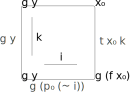

<!DOCTYPE html>
<html>
  <head>
    <meta charset="utf-8">
    <title>O kleju</title>
    <link rel="stylesheet" href="Agda.css" />
  </head>
  <body>
    <h1>Równość a równoważność</h1>
    <h2>Równość</h2>
    <h2>Równoważność</h2>
    <h3>Włókna</h3>
    <h3>Kurczliwość</h3>
    <h2>Izomorfizm</h2>
    <h3>Izomorfizm a równoważnośc</h3>
    <p>fill0:</p>
     
    <p>fill0</p>
    
```agda
{-# OPTIONS --cubical --safe #-}
module CzymJestKlej where

open import Cubical.Data.Nat
open import Cubical.Data.List
open import Cubical.Data.Unit
open import Cubical.Data.BinNat.BinNat
open import Cubical.Core.Everything
open import Cubical.Foundations.Everything

data Jednostka : Set where
  xd : Jednostka
--tt : Unit

ichDoMojego : Unit → Jednostka
ichDoMojego tt = xd

mójDoNich : Jednostka → Unit
mójDoNich xd = tt

aaa : isEquiv {A = Unit} (λ { tt → tt } )
equiv-proof aaa y = (tt , refl) , (λ y₁ i → tt , refl)

_ = transport
--równoważne : isEquiv ichDoMojego
--equiv-proof równoważne xd = (tt , λ _ → ichDoMojego tt) , λ { (tt , p) → λ i → ( {!!} , λ j → {!p !} ) }
{--

equiv-proof równoważne xd = (tt , λ _ → xd) , λ { (tt , p) → λ i → ( tt , λ j → {!p !} ) }

————————————————————————————————————————————————————————————
j : I
i : I
p : ichDoMojego tt ≡ xd
———— Constraints ———————————————————————————————————————————
?0 (i = i1) = p j : Jednostka
?0 (i = i0) = xd : Jednostka
?0 (j = i1) = xd : Jednostka
?0 (j = i0) = xd : Jednostka
--}

co : ∀ {ℓ} {A : Type ℓ} → isEquiv {A = A} {B = A} (λ x → x)
equiv-proof co y = ((y , refl)) , λ (x , x≡y) i → x≡y (~ i) , λ j → x≡y (~ i ∨ j)


_ = idEquiv
zero₀ : ℕ
zero₀ = zero
jeden₀ : ℕ
jeden₀ = suc zero

zero₁ : List Unit
zero₁ = []
jeden₁ : List Unit
jeden₁ = tt ∷ []

zero₂ : Binℕ
zero₂ = binℕ0
jeden₂ : Binℕ
jeden₂ = binℕpos (x1 binℕ0)
open import Cubical.Core.Everything

-- open import Cubical.Foundations.Isomorphism
-- open import Cubical.Foundations.Equiv

-- https://math.stackexchange.com/questions/3337390/glue-types-in-cubical-type-theory
testKleju : ∀ {ℓ ℓ′} {A B : Set ℓ}  {C : Set ℓ′} (eq₁ : A ≃ C) (eq₂ : B ≃ C) → A ≡ B
testKleju {A = A} {B = B} {C = C} eq₁ eq₂ i = Glue  C {φ = ~ i ∨ i} λ { (i = i0) → A , eq₁ ; (i = i1) → B , eq₂}
testKleju′ : ∀ {ℓ ℓ′} {A B : Set ℓ}  {C : I → Set ℓ′} (eq₁ : A ≃ (C i0)) (eq₂ : B ≃ (C i1)) → A ≡ B
testKleju′ {A = A} {B = B} {C = C} eq₁ eq₂ i = Glue (C i) {φ = ~ i ∨ i} λ { (i = i0) → A , eq₁ ; (i = i1) → B , eq₂}
---


-------------------------------------------------------
--- https://agda.readthedocs.io/en/v2.6.1/language/cubical.html
open import Cubical.Foundations.Prelude


--idIsEquiv : ∀ {ℓ} (A : Set ℓ) → isEquiv (idfun A)
--equiv-proof (idIsEquiv A) y =
--  ((y , refl) , λ z i → z .snd (~ i) , λ j → z .snd (~ i ∨ j))
{--
idEquiv : ∀ {ℓ} (A : Set ℓ) → A ≃ A
idEquiv A = (idfun A , idIsEquiv A)
ua : ∀ {ℓ} {A B : Set ℓ} → A ≃ B → A ≡ B
ua {_} {A} {B} e i = Glue B (λ { (i = i0) → (A , e)
                               ; (i = i1) → (B , idEquiv B) })

uaβ : ∀ {ℓ} {A B : Set ℓ} (e : A ≃ B) (x : A) → transport (ua e) x ≡ e .fst x
uaβ e x = transportRefl (e .fst x)
---
--}
```

    <h1>Bibliografia</h1>
    <ul>
      <li id="cold-introduction">Tesla Ice Zhang - Cold Introduction
        <a href="https://ice1000.org/2019/08-01-Cutt0.html">0</a>
        <a href="https://ice1000.org/2019/08-20-Cutt1.html">1</a>
        <a href="https://ice1000.org/2019/10-01-Cutt2.html">2</a>
        <a href="https://ice1000.org/2019/10-14-Cutt3.html">3</a>
      </li>
      <li id="dan-doel-so">Dan Doel -
        <a href="https://math.stackexchange.com/questions/3337390/glue-types-in-cubical-type-theory">Odpowiedź na stackoverflow.com dot. kleju</a></li>
      <li>Cyril Cohen, Thierry Coquand, Simon Huber and Anders Mörtberg -
        <a href="https://arxiv.org/abs/1611.02108">“Cubical Type Theory: a constructive interpretation of the univalence axiom”</a></li>
      <li><a href="https://agda.readthedocs.io/en/v2.6.1/language/cubical.html">Dokumentacja Agdy</a></li>
    </ul>
  </body>
</html>
